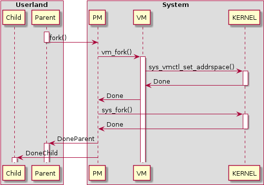
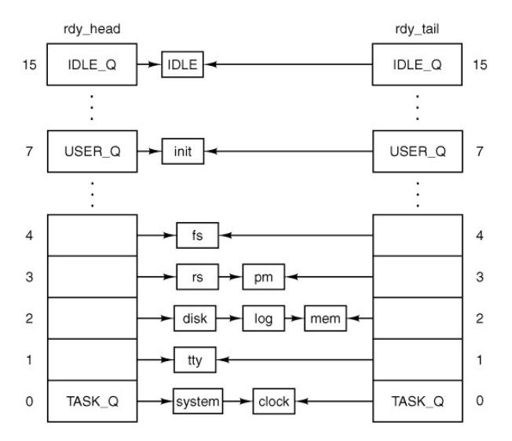

Link utili

_Per la guida a MINIX 3, cliccare al seguente link: https://wiki.minix3.org/doku.php_

_Per il source code di minix: https://github.com/Stichting-MINIX-Research-Foundation/minix_

_Per la presentazione, verrà aggiunto anche un file powerpoint_

Argomenti /RICERCA COMPARATIVA/:
- MINIX 3 Kernel API (important for SYSTEM CALLS and MEMORY MANAGEMENT): https://wiki.minix3.org/doku.php?id=developersguide:kernelapi
- Memomory grant (transfer datas): https://wiki.minix3.org/doku.php?id=developersguide:memorygrants
- Message passing (a sort of IPC): https://wiki.minix3.org/doku.php?id=developersguide:messagepassing
- Memory management: https://lass.cs.umass.edu/~shenoy/courses/spring20/lectures/lecture11-scribe.pdf (minix post 3.2) oppure https://wiki.minix3.org/doku.php?id=developersguide:vminternals
- Scheduling (processes): https://wiki.minix3.org/doku.php?id=releases:3.2.1:developersguide:userspace-scheduling&s[]=scheduling oppure https://minixnitc.github.io/scheduling.html (affidabile)

Argomenti contro-parte OS:
- System calls: https://ops-class.org/man/syscall/
- Processes scheduling: http://jhshi.me/2012/03/18/os161-process-scheduling/index.html


# Progetto 1.1: Analisi comparativa tra OS161 e altri sistemi operativi open-source all'avanguardia per sistemi embedded e computer general purpose

Per questo progetto abbiamo scelto di analizzare _MINIX 3_, un sistema operativo open source simile a Unix, progettato per scopi didattici e di ricerca, altamente affidabile e portatile.
_Minix_ è stato creato da Andrew S. Tanenbaum nel 1987 e da allora ha subito diverse revisioni importanti. Noi approfondiremo la versione 3.0 che è stata rilasciata nel 2005.

Di seguito verranno esaminate nel dettaglio le sue caratteristiche e messe a confronto con il sistema operativo OS161, studiato durante il corso di Programmazione di Sistema.  

# Sezione I: Analisi comparativa di OS161 e MINIX 3 #

## Architettura ##

_OS161_ è progettato come un sistema operativo monolitico, dove tutti i componenti chiave, come il kernel e i driver dei dispositivi, risiedono in uno spazio di indirizzamento comune.

_MINIX_, nelle sue prime versioni, è stato un sistema operativo monolitico, ma con l'evoluzione verso MINIX 3, si è adottata un'architettura a microkernel con un design modulare. In un microkernel, le funzionalità del sistema operativo sono suddivise in moduli separati che vengono eseguiti nello spazio utente, riducendo così la complessità del kernel e aumentando la sicurezza e la stabilità. È scritto in linguaggio C e assembly e supporta diverse piattaforme hardware, tra cui x86, ARM.


## System Calls ##

In generale le system calls dei due sistemi operativi non presentano grosse differenze, ma si differenziano su alcuni aspetti, quali: 
1) **Architettura**: OS161 è basato su MIPS, mentre MINIX, essendo general purpose, può essere usato su varie architetture Hardware.
2) **Gestione della memoria**: OS161 ha una gestione della memoria abbastanza semplificata (paginazione, visti a lezione), mentre MINIX possiede uno spazio "segmentato" (cioè distinzione/separazione tra spazio kernel ed utente, offrendo anche protezione dello spazio kernel in questo caso). Può risultare che questo modello di gestione della memoria di MINIX sia più semplice rispetto a quello di OS161 (che utilizza modelli di memoria paging più avanzata).
3) **Portabilità**: MINIX risulta essere più portabile rispetto ad OS161, in quanto supporta diverse architetture Hardware. 

Ora verranno esaminate più approfinditamente alcune delle principali system calls che caratterizzano OS161 e Minix3 (per analisi comparativa):

https://wiki.minix3.org/doku.php?id=developersguide:kernelapi

- SYS_FORK / https://github.com/Stichting-MINIX-Research-Foundation/minix/blob/master/minix/kernel/system/do_fork.c#L26
- SYS_EXEC / https://github.com/Stichting-MINIX-Research-Foundation/minix/blob/master/minix/kernel/system/do_exec.c
- SYS_EXIT / https://github.com/Stichting-MINIX-Research-Foundation/minix/blob/master/minix/kernel/system/do_exit.c
- SYS_CLEAR / https://github.com/Stichting-MINIX-Research-Foundation/minix/blob/master/minix/kernel/system/do_clear.c
- SYS_KILL / https://github.com/Stichting-MINIX-Research-Foundation/minix/blob/master/minix/kernel/system/do_kill.c
- SYS_REBOOT / https://github.com/Stichting-MINIX-Research-Foundation/minix/blob/4db99f4012570a577414fe2a43697b2f239b699e/minix/servers/pm/misc.c#L199
- SYS_WAITPID / https://github.com/Stichting-MINIX-Research-Foundation/minix/blob/4db99f4012570a577414fe2a43697b2f239b699e/minix/servers/pm/forkexit.c#L475


### SYS_FORK ###

La system call FORK causa la creazione di un nuovo processo "figlio" a partire da un "padre", e il processo che si verrà a creare sarà esattamente una copia del "padre", fatta eccezzione per alcune caratteristiche, come ad esempio l'ID del "figlio" che è unico e diverso da quello del "padre". 


_Immagine inerente al processo di fork_

 ```c
// MINIX
int sys_fork(parent, child, child_endpoint, flags, msgaddr)
    endpoint_t parent;		/* process doing the fork */
    endpoint_t child;		/* which proc has been created by the fork */
    endpoint_t *child_endpoint;
    u32_t flags;
    vir_bytes *msgaddr;
{
    /* code */
} 
```

- `endpoint_t parent` indica l'endpoint (ID di endpoint) del processo padre.
- `endpoint_t child` indica  l'endpoint del nuovo processo figlio creato dalla chiamata fork.
- `endpoint_t *child_endpoint` è un puntatore a un endpoint_t, e viene utilizzato per restituire l'endpoint del processo figlio al processo padre.
- `u32_t flags` può essere utilizzata per indicare alcune opzioni o comportamenti desiderati per la fork.
- `vir_bytes *msgaddr` rappresenta l'indirizzo in cui il messaggio viene passato tra il processo padre e il processo figlio dopo la fork.


```c
// OS161
pid_t sys_fork(struct trapframe *tf, int *retval) {
    /* code */
}
```
- `struct trapframe *tf` è un puntatore a una struttura di dati chiamata "trapframe", che rappresenta lo stato del thread corrente nel momento in cui viene effettuata la chiamata di sistema "fork". Nella chiamata di sistema "fork", il trapframe contiene lo stato del thread corrente, che verrà duplicato nel nuovo processo creato.
- `int *retval` è un puntatore a un intero (int), utilizzato per restituire il valore di ritorno della chiamata di sistema "fork". Il valore di ritorno sarà il PID (Process ID) del nuovo processo figlio nel processo padre e 0 nel processo figlio.


### SYS_EXIT ###

La system call EXIT è una chiamata di sistema utilizzata per terminare un processo in un sistema operativo. Quando un programma chiama la funzione `exit`, il processo corrente viene terminato e le risorse associate ad esso, come la memoria, i file aperti e altre risorse di sistema, vengono rilasciate. Prima di terminare il processo viene di solito restituito un valore di uscita al chiamante, che può essere recuperato dal processo padre o dal sistema operativo e utilizzato per valutare lo stato di terminazione del processo.

Nella versione base di OS161, manca il supporto per la system call `exit`, infatti al termine di un programma (fine del main) si possono verificare crash del sistema, in quanto non esiste supporto per tale operazione. L'implementazione della system call è stata gestita durante i laboratori del corso di Programmazione di Sistema, in modo da segnalare il processo corrente come _terminato_ e liberare tutte le sue risorse. 

In MINIX, il processo corrente viene terminato e segnalato come "zombie". Un processo zombie è un processo che ha terminato l'esecuzione, ma il suo stato di terminazione non è ancora stato raccolto dal padre. Inoltre MINIX offre un meccanismo più sofisticato per la gestione dei processi figli, ovvero implementa un meccanismo chiamato _reaper_. Il reaper è un processo separato che si occupa di raccogliere gli stati di terminazione dei processi figli zombie. Quando un processo padre richiede lo stato di terminazione di un processo figlio zombie, il reaper lo raccoglie e restituisce le informazioni appropriate al padre. OS161 invece non ha un meccanismo specifico per la gestione dei processi figli terminati.

I prototipi nei due sistemi operativi risultano molto simili:

```c
//OS161
void sys_exit(int exitcode) {
    /* ... */
}
```

In OS161 il parametro `exitcode` è il codice di uscita del processo che sta terminando e verrà restituito al processo genitore per indicare lo stato di terminazione del processo.

```c
//MINIX
int sys_exit() {
  /* Un processo di sistema richiede di uscire. */
  message m;

  return(_kernel_call(SYS_EXIT, &m));
}
```
In Minix la funzione utilizza una struttura dati denominata `message` per comunicare con il kernel del sistema operativo. Il codice `_kernel_call` è utilizzato per invocare la system call di uscita del sistema (SYS_EXIT) passando la struttura `m` come parametro.
La funzione `sys_exit` restituirà il valore ottenuto dalla system call di uscita del sistema, il quale può essere utilizzato per eseguire ulteriori azioni o per controllare se la terminazione del processo è avvenuta con successo.

### SYS_EXEC ###


### SYS_WAITPID ###


### SYS_KILL ###


## Scheduling ##

### Obiettivi ###

_OS161_ e _MINIX 3_ sono entrambi sistemi operativi utilizzati per scopi didattici, ma presentano approcci diversi rispetto alla gestione dello scheduling dei processi. _OS161_ è principalmente un sistema operativo didattico per l'apprendimento dei concetti dei sistemi operativi con un'implementazione semplice. _MINIX 3_ è un sistema operativo di ricerca più completo che fornisce una pianificazione più sofisticata e adatta per scenari reali, prestandosi bene ad esigenze specifiche e ambienti diversi.

### Politiche di Scheduling ###

Le politiche di scheduling di _OS161_ e _MINIX 3_ risultano diverse avendo obiettivi diversi.

In particolare, _OS161_ utilizza una politica di scheduling semplice e predefinita basata sull'approccio Round Robin (RR), dove i processi vengono assegnati in base al loro ordine di arrivo. Inoltre, non è possibile implementare politiche di scheduling personalizzate poiché l'allocazione del tempo della CPU è principalmente gestita dal kernel per ragioni di sicurezza e stabilità.

_MINIX_ invece utilizza una politica di scheduling più sofisticata, chiamata Multilevel Feedback Queue (MFQ). L'algoritmo MFQ prevede l'esistenza di più code con diversi livelli di priorità. A differenza di OS161, le priorità non sono fisse, infatti i processi vengono inizialmente inseriti nella coda di priorità più alta e se un processo utilizza tutto il suo quantum di tempo senza terminare, viene degradato nella coda di priorità inferiore. D'altra parte, se un processo è bloccato o termina prima di utilizzare tutto il suo quantum, viene promosso alla coda di priorità superiore. Questa politica offre maggiore flessibilità e consente agli sviluppatori di definire algoritmi di scheduling specifici per gruppi di processi con esigenze diverse o applicazioni particolari.

### Implementazione ###

_OS161_ implementa l'algoritmo Round Robin con una singola coda, in cui ogni processo riceve un quantum di tempo assegnato e, quando il quantum scade, il processo viene messo in coda e viene eseguito il successivo processo pronto. Questo ciclo di esecuzione continua finchè ci sono processi nella coda pronti ad essere eseguiti. 

In _Minix_ lo scheduling dei processi è gestito da un insieme di procedure che lavorano insieme per gestire le transizioni di stato e le priorità dei processi:
- **Enqueue:** è responsabile di aggiungere un processo ad una specifica coda di scheduling in base alla sua priorità. Minix infatti utilizza un algoritmo di scheduling basato sulla priorità, dove i processi con una priorità più alta vengono eseguiti prima dei processi con priorità più bassa. La procedura _Enqueue_ si occupa di inserire un processo nella coda appropriata in base alla sua priorità e per poter svolgere questa operazione ha bisogno di conoscere:
    - su quale ready queue attestare il processo
    - se metterlo in testa o in coda
    
    Tali informazioni sono passate alla ready dalla funzione _sched_.

- **Dequeue:** rimuove un processo da una specifica coda di scheduling quando non è più idoneo per l'esecuzione o deve essere sospeso per qualche motivo. Quando un processo viene rimosso dalla coda (dequeued), significa che è stato tolto dalla coda di scheduling e non può essere selezionato per l'esecuzione finché non viene nuovamente inserito (enqueued).
- **Sched:** fondamentalmente rappresenta il "cuore" del meccanismo di scheduling in Minix. Essa determina quale processo deve essere eseguito successivamente, per cui è responsabile di selezionare il processo con la priorità più alta tra quelli presenti nelle code dei processi pronti. La procedura "Sched" viene chiamata periodicamente dal timer del kernel o da altri eventi di sistema per decidere quale processo dovrebbe ricevere il tempo di esecuzione della CPU.
- **Pick proc:** seleziona il primo processo disponibile nella ready queue di priorità più alta, scandendo tutte le code. Il processo scelto verrà poi eseguito.

Questo algoritmo di scheduling in Minix mira a fornire un accesso equo alla CPU per tutti i processi in base alle loro priorità. I processi con priorità più alta otterranno più tempo di CPU rispetto a quelli con priorità più bassa.


_Coda iniziale dei processi in Minix 3_

### Gestione delle priorità ###

OS161 possiede un sistema più semplice e prevedibile, in cui, nella versione base, non esiste il concetto di priorità. Ciò significa che un processo continuerà ad essere eseguito finché non avrà terminato la sua esecuzione, indipendentemente dai requisiti di CPU di altri processi.

_Minix_ invece organizza i processi in 16 code di priorità su diversi livelli. Ogni processo viene inizialmente assegnato ad una coda di priorità in base alla sua categoria, che può essere task, driver, server o processo utente. I processi con priorità più alta si trovano nella coda 0 e quelli con priorità più bassa nella coda 15. Le code 0-6 sono riservate ai processi di sistema. Le code 7-14 sono riservate ai processi utente. Il processo inattivo è pianificato nella coda 15 e ha la priorità più bassa.


_Scheduling queues in Minix 3_

Quando deve essere scelto un nuovo processo da eseguire, si cerca il processo a partire dalla coda più alta. Se non ci sono processi pronti, viene eseguito il processo inattivo. 
Tuttavia, lo scheduler può modificare la priorità del processo e il quantum temporale mediante sys_schedule(), rendendo nuovamente eseguibile il processo. Per questo motivo, possiamo dire che Minix possiede una gestione dello scheduling più dinamica rispetto a OS161. Inoltre, Minix 3 utilizza un meccanismo di invecchiamento che aumenta gradualmente la priorità dei processi che non sono stati eseguiti per un lungo periodo di tempo. Se, invece, un processo utilizza troppo tempo della CPU, la sua priorità può essere temporaneamente ridotta per garantire che altri processi abbiano la possibilità di essere eseguiti.

### La gestione delle interruzioni ###

_OS161_ ha un semplice sistema di gestione delle interruzioni, in cui le routine di servizio delle interruzioni salvano lo stato del processo corrente, eseguono il gestore di interruzioni ed infine ripristinano lo stato del processo. Questo approccio è facile da implementare, ma non è molto flessibile e può portare a latenze di interruzioni elevate se si verificano molte interruzioni in successione.

_Minix 3_ invece possiede un sistema di gestione delle interruzioni più sofisticato. Ogni dispositivo ha un proprio thread di servizio delle interruzioni, che è responsabile del trattamento delle interruzioni per quel dispositivo. Questo approccio migliora l'affidabilità del sistema, poiché un errore nel thread di servizio delle interruzioni di un dispositivo non influisce sugli altri dispositivi.
Inoltre viene utilizzato un approccio di scheduling pre-emptive, ovvero il sistema operativo può interrompere l'esecuzione di un processo per eseguire un altro processo con priorità più alta e garantire che i processi a priorità più elevata vengano eseguiti in modo tempestivo. Nello specifico, quando un'interfaccia di input/output (I/O) completa un'operazione, genera un'interruzione che viene ricevuta dal kernel. Il kernel a quel punto interrompe il processo che stava attendendo, salvando lo stato attuale, e risponde all'interfaccia di I/O, solitamente attraverso l'invio di un messaggio al processo interessato per avvisarlo che i dati sono disponibili. Tuttavia, la gestione delle interruzioni può portare a problemi di sincronizzazione se non viene gestita correttamente. Per evitare tali problemi, viene utilizzato un approccio di scheduling cooperativo. In particolare, lo scheduler viene eseguito solo quando viene generata un'interfaccia di sistema o un'interruzione di clock. In questo modo, lo scheduler viene eseguito solo in momenti specifici dell'esecuzione del sistema operativo, evitando così problemi di sincronizzazione. Questa implementazione garantisce una maggiore affidabilità anche in presenza di processi ad alta priorità o di interruzioni di sistema.

### Conclusioni ###
In conclusione, entrambi i sistemi operativi hanno i loro vantaggi e svantaggi. L'approccio di scheduling di MINIX 3 è più flessibile e sofisticato rispetto a quello di OS161, poiché consente di gestire in modo più preciso le priorità dei processi e di evitare problemi di sincronizzazione. Tuttavia, OS161 rimane un'opzione valida per l'apprendimento e la comprensione dei concetti dei sistemi operativi grazie alla sua semplicità e alla sua implementazione didattica.


## Gestione della memoria ##
_Premessa: il sistema operativo MINIX è basato su architettura a Microkernel, il che semplifica la gestione del kernel e sposta, di conseguenza, le funzionalità più complesse in spazi utente chiamati "server" (es. gestione dei file system, gestione memoria virtuale etc...). Si ricorda anche che MINIX pre-3.1 non supporta paginazione (i processi sono allocati in maniera contigua all'interno della memoria), mentre dalla versione 3.2 supporta questa caratteristica._

Andiamo adesso ad approfondire le differenze/somiglianze sulla gestione di memoria tra MINIX e OS161. 

**Paging e virtual memory**

Dalla versione 3.2 di MINIX, questo sistema operativo supporta la paginazione, la memoria virtuale e la paginazione su richiesta (paging, virtualization and demand paging): ogni processo ha segmenti allocati in maniera anche non contigua nello spazio di indirizzamento virtuale, ma non vi sono assunzioni di contiguità sulla memoria fisica. Ne deriva il fatto che sia MINIX, sia OS161 hanno supporto per Paging e Memoria virtuale (che quindi consente di separare lo spazio di indirizzamento virtuale di un processo dalla memoria fisica, permettendo maggiore isolamento e protezione dei processi).

Si può, inoltre, evincere che entrambi i sistemi operativi utilizzino le tabelle (Page table) per gestire la paginazione e mappare gli indirizzi virtuali degli utenti agli indirizzi fisici della memoria, oltre che l'uso di strutture dati come Bitmap o Linked List. Anche per quanto riguarda gli algoritmi di allocazione (della memoria fisica), entrambi i sistemi operativi condividono certe soluzioni, quali: First-fit, Best-fit, Worst-fit (MINIX possiede anche Next-fit e Quick-fit); si ricorda, però, che queste soluzioni non riguardano le ultime versioni di MINIX (post-3.2), le quali usano "holes and allocation", ovvero buchi e allocazione nello spazio di indirizzamento virtuale (quindi allocazione anche NON contigua nello spazio d'indirizzamento virtuale).

Passando alla gestione degli errori (quindi i cosiddetti Page fault), entrambi i sistemi operativi gestiscono questo fenomeno in maniera simile (anche se in OS161 questi aspetti sono più semplificati). Distiguiamo due casi (della gestione) per MINIX: 

1) Quando un processo tenta di accedere a una parte della memoria virtuale che non è ancora stata mappata a una pagina fisica. In questo caso, MINIX può allocare una nuova pagina fisica e mapparla nello spazio di indirizzamento del processo.

2) Quando un processo tenta di accedere a una parte della memoria virtuale mappata a un file. In questo caso, il server VM, prima di tutto, verifica nella cache delle pagine per vedere se la pagina richiesta è presente. Se è presente, la pagina viene caricata direttamente dalla cache alla memoria fisica. In caso contrario, il server VM dovrà consultare il file system (VFS - Virtual File System) per recuperare la pagina richiesta dal file sorgente e caricarla nella memoria fisica.

**Gestione delle chiamate**

Quando la VM riceve delle chiamate dallo spazio utente, dal Process Manager o dal kernel, esso riceverà la richiesta e la elaborerà nella seguente maniera:
1) Ricezione del messaggio in main.c
2) Viene eseguito il lavoro specifico associato alla chiamata
3) Aggiornamento delle strutture dati coinvolti dalla chiamata (es: region.c, pagetable.c etc...)

In OS161, il "flusso" di gestione delle chiamate di sistema è pressochè simile, ovviamente facendo distinzione tra i diversi sistemi operativi, che quindi può portare ad usare strutture dati, interfacce e complessità differenti tra un'architettura e l'altra.

_to be continued... ( + PM + ipotetiche conclusioni?)_

## Meccanismi di sincronizzazione ##

(Spinlocks, semafori, condition variables, deadlock...) 
+ da fare!!


# Sezione II: Implementazione di nuove funzionalità  #
Scelte tre:

1) Scheduler più avanzato: Se OS161 ha un scheduler con politiche di pianificazione avanzate (ad esempio, algoritmi di scheduling come Round Robin, Priority-based, etc.), potresti considerare di implementare una versione più avanzata di scheduler in MINIX per ottimizzare l'allocazione delle risorse del sistema.

2) Gestione della memoria fisica migliorata: Esplorare l'implementazione di una gestione della memoria fisica più efficiente o adottare meccanismi di paginazione avanzati presenti in OS161 per ottimizzare l'allocazione e la gestione della memoria fisica.

3) File System più avanzato: Se OS161 ha un file system con funzionalità aggiuntive o prestazioni migliorate, potresti lavorare per implementare un nuovo file system o estendere quello esistente in MINIX per offrire funzionalità avanzate.
https://web.ecs.syr.edu/~wedu/seed/Documentation/Minix3/How_to_add_system_call.pdf

4) Miglioramento delle prestazioni: Potresti analizzare il codice e l'implementazione di MINIX per identificare aree che potrebbero essere ottimizzate per migliorare le prestazioni generali del sistema operativo.

5) Sicurezza e Protezione: Aumentare le politiche di sicurezza di MINIX 3.0

6) Gestione dei dispositivi: Migliorare la gestione dei dispositivi in MINIX 3.0 (più semplice rispetto ad OS161)

7) Interfacce di Sistema: Aggiungere nuove interfacce di sistema

8) Supporto per i segnali: Implementare un sistema di gestione dei segnali più completo o estendere le funzionalità esistenti per consentire una maggiore flessibilità nel trattamento dei segnali da parte dei processi.