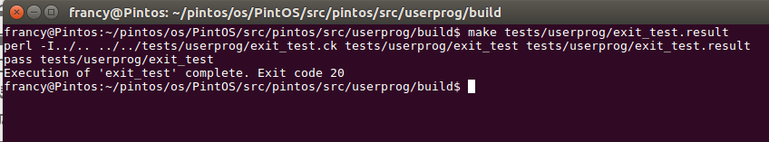

# Link Utili per la ricerca
- Pintos doc: https://cs162.org/static/proj/pintos-docs/
- Pintos doc by Stanford (PDF): https://web.stanford.edu/class/cs140/projects/pintos/pintos.pdf
- 

Argomenti contro-parte OS:
- System calls: https://ops-class.org/man/syscall/
- Processes scheduling: http://jhshi.me/2012/03/18/os161-process-scheduling/index.html
- Understanding system calls: https://tddg.github.io/cs571-spring20/proj2_understand_syscalls.html

# Progetto 1.1: Analisi comparativa tra OS161 e altri sistemi operativi open-source all'avanguardia per sistemi embedded e computer general purpose

Per questo progetto abbiamo scelto di analizzare _pintOS_, un sistema operativo didattico open source per l'architettura del set di istruzioni x86, attualmente in uso in diversi istituti. Fu creato all'università di Stanford da Ben Pfaff nel 2004, originariamente pensato per sostituire il sistema operativo NachOS, un sistema simile creato dalla University of California a Berkeley. A differenza di NachOS, PintOS può essere eseguito sull'hardware x86 reale, sebbene venga spesso eseguito su un'emulatore di sistema, come Bochs o Qemu. Noi abbiamo utilizzato il simulatore QEMU.

Di seguito verranno esaminate nel dettaglio le sue caratteristiche e messe a confronto con il sistema operativo OS161, studiato durante il corso di Programmazione di Sistema.  

# Sezione I: Analisi comparativa di OS161 e Pintos #

## Architettura ##

_OS161_ è progettato come un sistema operativo monolitico, dove tutti i componenti chiave, come il kernel e i driver dei dispositivi, risiedono in uno spazio di indirizzamento comune.

_pintOS_ invece è progettato come un sistema operativo di tipo microkernel, che significa che il kernel è diviso in componenti più piccoli e indipendenti chiamati thread utente. Questi thread utente implementano le diverse funzionalità del sistema operativo.


_pintOS_ utilizza il concetto di "thread utente" per rappresentare i processi. Ogni thread utente contiene le informazioni necessarie per l'esecuzione del processo, come il codice del programma, lo stato del processore e lo stato di I/O. I thread utente sono implementati come thread del kernel, il che semplifica la gestione dei processi.

## System Calls ##

Le system calls (chiamate di sistema) sono funzioni fornite dal sistema operativo per consentire ai programmi di interagire con il kernel (il nucleo del sistema operativo) e sfruttare le risorse del sistema, come l'hardware, i file, la memoria e altro. Sono fondamentali per il funzionamento dei sistemi operativi e svolgono un ruolo cruciale in vari aspetti:

1. **Gestione delle risorse**: Le system calls consentono ai programmi di richiedere l'allocazione e la liberazione di risorse hardware, come memoria, CPU e dispositivi di I/O. Ad esempio, una system call può essere utilizzata per richiedere memoria dinamica o per leggere da un file su disco.

2. **Protezione**: Le system calls impediscono ai programmi utente di accedere direttamente alle risorse hardware o di eseguire operazioni pericolose. Questo garantisce che il sistema operativo abbia il controllo su quali risorse vengono allocate o condivise tra i processi e previene l'accesso non autorizzato.

3. **Comunicazione tra processi**: Le system calls consentono la comunicazione tra i processi. Ad esempio, è possibile utilizzare system calls per creare processi figlio, condividere dati tra processi o sincronizzare l'esecuzione di processi diversi.

4. **Gestione dei file**: Molte system calls sono dedicate alla gestione dei file, inclusa la creazione, l'apertura, la lettura, la scrittura e la chiusura dei file. Queste operazioni sono fondamentali per l'archiviazione e il recupero dei dati.

5. **Gestione delle interruzioni**: Le system calls consentono al kernel di gestire le interruzioni hardware e rispondere a eventi come la pressione di un tasto sulla tastiera o l'arrivo di dati in una porta di rete.

6. **Comunicazione di rete**: System calls sono spesso utilizzate per la comunicazione di rete, consentendo ai programmi di inviare e ricevere dati su una rete, come Internet.

_Os161_ e _Pintos_, sono sistemi operativi progettati per scopi didattici, per cui in entrambi nativamente manca il supporto completo delle system calls, come si può vedere di seguito:

* `kern/arch/mips/syscall/syscall.c` in _OS161_

```c
 void syscall(struct trapframe *tf) {
	int callno;
	int32_t retval;
	int err;
    ...

	callno = tf->tf_v0;
	retval = 0;

	switch (callno) {
	    case SYS_reboot:
		err = sys_reboot(tf->tf_a0);
		break;

	    case SYS___time:
		err = sys___time((userptr_t)tf->tf_a0,
				 (userptr_t)tf->tf_a1);
		break;

	    /* Add stuff here */

	    default:
		kprintf("Unknown syscall %d\n", callno);
		err = ENOSYS;
		break;
	}
    ...
 ```

 * `src/userprog/syscall.c` in _Pintos_

 ```c
#include "userprog/syscall.h"
#include <stdio.h>
#include <syscall-nr.h>
#include "threads/interrupt.h"
#include "threads/thread.h"

static void syscall_handler (struct intr_frame *);

void syscall_init (void) {
  intr_register_int (0x30, 3, INTR_ON, syscall_handler, "syscall");
}

static void syscall_handler (struct intr_frame *f UNUSED) {
  printf ("system call!\n");
  thread_exit ();
}
 ```
 Vedremo l'implementazione di alcune system calls in _Pintos_ nella **sezione II** del progetto.

## Scheduling ##

### Politiche di Scheduling ###

Le politiche di scheduling di _OS161_ e _pintOS_ risultano simili, essendo sistemi operativi didattici, utilizzati spesso in corsi universitari per insegnare i principi dei sistemi operativi.

Infatti, entrambi utilizzano una politica di scheduling semplice e predefinita basata sull'approccio Round Robin (RR), dove i processi vengono assegnati in base al loro ordine di arrivo. 
Tuttavia, sia in _OS161_ che in _Pintos_, è possibile implementare, come estensione del sistema operativo, politiche di scheduling più avanzate come il Multi-Level Feedback Queue (MLFQ), il Dynamic Priority Scheduling o l'Inverse Priority Scheduling. 

### Implementazione ###

Entrambi i sistemi operativi, implementano l'algoritmo Round Robin, in cui i processi vengono schedulati in modo circolare. Ogni processo riceve un quantum di tempo assegnato (in _Pintos_ `#define TIME_SLICE 4`) e, quando il quantum scade, il processo viene messo in coda e viene eseguito il successivo processo pronto. Questo ciclo di esecuzione continua finchè ci sono processi nella coda pronti ad essere eseguiti. Non c'è nessuna gestione di priorità: tutti i thread sono trattati allo stesso modo.

In _Pintos_ la funzione responsabile di "restituire" la CPU allo scheduler e consentire agli altri thread di essere eseguiti è la `thread_yield`.

```c
void thread_yield (void) {

  /* Puntatore al thread corrente */
  struct thread *cur = thread_current ();
  enum intr_level old_level;

  /* Si verifica che la funzione non sia chiamata da un gestore di interrupt */
  ASSERT (!intr_context ());

  old_level = intr_disable ();
  if (cur != idle_thread)
    list_push_back (&ready_list, &cur->elem);
  cur->status = THREAD_READY;
  schedule ();
  intr_set_level (old_level);
}
```
La funzione `thread_yield` consente al thread corrente di rilasciare volontariamente la CPU e di diventare pronto per essere eseguito nuovamente, ma senza mettersi in attesa. Ciò è utile per consentire allo scheduler di determinare quale thread deve essere eseguito successivamente, senza causare un ritardo significativo.

Se il thread corrente non è l'`idle_thread` (il thread inattivo), il thread corrente viene inserito nella coda dei thread pronti (`ready_list`) utilizzando la `list_push_back()`. Questo significa che il thread è pronto ad essere eseguito, ma lo scheduler può decidere di concedere la CPU ad un altro thread prima di eseguirlo nuovamente. Viene impostato lo stato del thread corrente a `THREAD_READY`, indicando che il thread è pronto per l'esecuzione ma non è attualmente in esecuzione. Viene chiamata poi la funzione `schedule()` per permettere allo scheduler di decidere quale thread eseguire successivamente.

Alla fine viene ripristinato il livello di interrupt utilizzando `intr_set_level (old_level)` e permettere che gli interrupt siano nuovamente abilitati alla priorità iniziale, prima della chiamata a `thread_yield`.

```c
static void schedule (void) {
  struct thread *cur = running_thread ();
  struct thread *next = next_thread_to_run ();
  struct thread *prev = NULL;

  /* Asserzioni per verificare che le interruzioni siano disabilitate e che il thread corrente non sia più in uno stato di esecuzione. */
  ASSERT (intr_get_level () == INTR_OFF);
  ASSERT (cur->status != THREAD_RUNNING);
  ASSERT (is_thread (next));

  if (cur != next)
    prev = switch_threads (cur, next);
  thread_schedule_tail (prev);
}
```
La funzione `schedule()`, nel dettaglio, svolge un ruolo essenziale: ottiene un riferimento al thread corrente con `running_thread()` e un riferimento al successivo thread da eseguire con `next_thread_to_run()`. Il `next_thread_to_run` è selezionato dallo scheduler e rappresenta il successivo thread nella coda dei thread pronti (`ready_list`). Se il thread corrente (`cur`) è diverso dal successivo thread da eseguire (`next`), la funzione chiama `switch_threads` per effettuare una commutazione di contesto tra i due thread, ossia restituire un riferimento al thread che stava precedentemente in esecuzione. Questa operazione comporta la modifica dei registri della CPU in modo che il successivo thread possa essere eseguito. La funzione `schedule` richiama poi `thread_schedule_tail` per completare il processo di pianificazione e assicurarsi che il successivo thread sia in esecuzione. La variabile `prev` è utilizzata per tracciare il thread precedentemente in esecuzione, se è stato commutato.

### Gestione delle priorità ###

Nella versione base, per entrambi i sistemi, non esiste il concetto di priorità. Ciò significa che un processo continuerà ad essere eseguito finché non avrà terminato la sua esecuzione, indipendentemente dai requisiti di CPU di altri processi.

### La gestione delle interruzioni ###

_OS161_ ha un semplice sistema di gestione delle interruzioni, in cui le routine di servizio delle interruzioni salvano lo stato del processo corrente, eseguono il gestore di interruzioni ed infine ripristinano lo stato del processo. Questo approccio è facile da implementare, ma non è molto flessibile e può portare a latenze di interruzioni elevate se si verificano molte interruzioni in successione.

### Conclusioni ###

In conclusione, _OS161_ e _Pintos_, sono entrambi sistemi operativi utilizzati per scopi didattici, tuttavia il primo è più orientato all'apprendimento dei concetti dei sistemi operativi con un'implementazione semplice, il secondo fornisce una base più operativa per gli studenti, poichè mira ad essere un sistema operativo di base che sia in grado di eseguire applicazioni reali.
Entrambi gli ambienti sono validi per l'apprendimento dei principi di scheduling, ma il loro focus differisce leggermente in base agli obiettivi educativi.

## Gestione della memoria ##

**Paging e virtual memory**

Pintos implementa una gestione della memoria virtuale di base. Questo include la paginazione e la gestione dello spazio degli indirizzi dei processi, consentendo ai processi di operare in spazi di indirizzamento separati e protetti. Utilizza, inoltre, un file speciale chiamato "pagina di swap" per memorizzare temporaneamente le pagine fisiche quando la memoria fisica è esaurita. Questo permette di gestire i casi in cui la memoria fisica è piena, spostando le pagine meno utilizzate in memoria su disco e recuperandole quando necessario.

Più in particolare, la memoria fisica di _Pintos_ è suddivisa in pagine di dimensioni fisse, e ogni pagina ha un numero di pagina univoco. Ogni processo ha un proprio spazio di indirizzamento virtuale, suddiviso in pagine. La mappatura tra gli indirizzi virtuali dei processi e gli indirizzi fisici delle pagine è gestita da una tabella delle pagine (Page Table) specifica per ciascun processo. Esso fa uso di strutture dati quali vettori, liste, bitmap ecc... ma principalmente _Pintos_ include una struttura di tipo BitMap per tenere traccia dell'utilizzo in un insieme di risorse (identiche), e inoltre utilizza anche una struttura di tipo Hash Table che supporta, in maniera efficiente, le inserimenti ed eliminazioni su un'ampia gamma di tabelle. 

Per questi motivi _Pintos_ possiede un sistema di paginazione e memoria virtuale simile a quello presente su OS161, mentre la sostanziale differenza risiede nel livello di complessità con cui sono state implementate queste funzioni.
La paginazione presente in OS161 è più avanzata, offrendo quindi funzionalità aggiuntive rispetto a Pintos.


**Gestione delle chiamate**

In _Pintos_, le chiamate di sistema (system calls) sono gestite tramite una serie di passaggi che coinvolgono l'utente, il kernel e il sistema operativo.

Quando un processo utente desidera effettuare una chiamata di sistema utilizza una funzione o un'istruzione speciale, che genera un'interruzione o una trap e questa operazione passa il controllo al kernel. Una volta generata l'interruzione, il controllo viene passato al dispatcher di sistema del kernel. Il dispatcher è responsabile di identificare il tipo di chiamata di sistema richiesta e di instradare l'esecuzione al gestore appropriato. Il kernel di _Pintos_ effettua la validazione e l'autenticazione delle chiamate di sistema. Verifica che il processo utente abbia i diritti necessari per eseguire la chiamata di sistema richiesta e che i parametri passati siano validi, e una volta che il kernel ha verificato e autenticato la chiamata di sistema, esegue il servizio richiesto dal processo utente. Dopo aver eseguito la chiamata di sistema e soddisfatto la richiesta del processo utente, il kernel restituisce il controllo al processo utente.

_OS161_ implementa in maniera simile a Pintos la gestione delle chiamate, tenendo però conto delle differenze di codice e strutture dati utilizzate da entrambi i sistemi operativi.

## Meccanismi di sincronizzazione ##

### Problemi della programmazione concorrente ###

Una **critical section** è un concetto fondamentale nell'ambito della programmazione concorrente e parallela. Rappresenta una porzione di codice in un programma in cui viene eseguita un'operazione che coinvolge risorse condivise, come variabili o strutture dati, che possono essere accessibili da più thread o processi contemporaneamente. L'obiettivo principale della protezione di una critical section è garantire la correttezza e l'integrità dei dati, evitando situazioni di accesso concorrente che potrebbero portare a risultati indesiderati o inconsistenze.

I problemi principali che possono sorgere in relazione alle critical section sono:

1. **Race Condition**:  si verifica quando due o più thread o processi cercano di accedere contemporaneamente alla stessa risorsa condivisa senza sincronizzazione adeguata. Questo può portare a risultati imprevedibili o errati poiché l'ordine di esecuzione delle istruzioni non è garantito.
2. **Deadlock**: si verifica quando due o più thread o processi si bloccano reciprocamente, ciascuno aspettando che una risorsa venga rilasciata dall'altro. In altre parole, si crea una situazione in cui nessun thread può procedere, impedendo il completamento dell'esecuzione.
3. **Starvation**: si verifica quando un thread viene continuamente prevenuto dall'accedere a una risorsa condivisa da altri thread che la monopolizzano. Ciò potrebbe portare a un'inefficienza complessiva del sistema, poiché alcuni thread potrebbero essere costantemente trascurati.
4. **Livelock**: è una situazione simile al deadlock, ma in questo caso i thread non sono bloccati completamente; invece, sono in uno stato attivo e in continuo scambio di risorse, ma senza alcun progresso reale nell'esecuzione.
Le critical section sono quindi parti cruciali di un programma in cui l'accesso concorrente alle risorse condivise deve essere attentamente gestito per garantire la correttezza e l'affidabilità del software.

I **meccanismi di sincronizzazione** fungono da ponti tra i thread o i processi, permettendo loro di coordinarsi e collaborare nell'accesso alle risorse condivise. 
I principali meccanismi di sincronizzazione sono: Mutex, Semaphore, Locks e Condition Variables.

### Mutex e Spinlock ###

Sia _Pintos_ che _OS161_ condividono parti comuni nella gestione di **Mutex** e **Spinlock**. Innanzitutto, definiscono strutture di dati specializzate che contengono informazioni cruciali, come lo **stato del lock** e l'**identificatore** del thread/processo detentore. Inoltre, entrambi offrono funzionalità per l'inizializzazione di questi meccanismi, consentendo di configurare adeguatamente le loro proprietà iniziali.
L'**acquisizione** dei mutex o spinlock è un altro aspetto comune: entrambi i sistemi forniscono funzioni attraverso le quali un thread o un processo può richiedere l'accesso esclusivo a una risorsa condivisa. Nel caso in cui il lock sia già detenuto, il thread/processo richiedente dovrà attendere fino a quando il lock non sarà rilasciato.
Il **rilascio** è altrettanto importante: una volta che un thread o processo ha terminato di utilizzare una risorsa condivisa, è cruciale rilasciare il lock corrispondente per permettere ad altri thread/processi in attesa di accedere alla risorsa.

### Semafori ###

I semafori sono meccanismi di sincronizzazione utilizzati per coordinare l'accesso a risorse condivise tra più processi o thread, consentono di regolare l'ordine di esecuzione delle attività evitando problemi come le condizioni di gara e l'accesso simultaneo a risorse critiche. Sono usati per garantire la coerenza e la correttezza dei dati in ambienti concorrenti, controllando l'accesso alle risorse attraverso operazioni di incremento e decremento.

_Pintos_ fornisce funzioni standard per l'inizializzazione dei semafori, l'acquisizione e il rilascio di semafori, nonché altre operazioni comuni. Ad esempio, sema_init(), sema_down(), e sema_up() sono alcune delle funzioni standard utilizzate per lavorare con i semafori. Inoltre, offre anche un sistema di gestione delle priorità, e i semafori sono spesso utilizzati per la sincronizzazione e il rilascio di thread in base alle priorità.

(Da mettere o no ?)Il principale punto di differenza tra Pintos e OS161 nella gestione dei semafori riguarda il livello di astrazione e personalizzazione. _Pintos_ offre una libreria di sincronizzazione standard con funzioni predefinite per semplificare l'uso dei semafori, mentre _OS161_ potrebbe richiedere di implementare i semafori da zero o definire le proprie API.

Nel caso di OS161, l'implementazione dei semafori si differenzia in alcuni aspetti. 
Il sistema offre due tipi principali di semafori: **semafori di conteggio** e **semafori binari**.
I primi possono assumere valori interi in un dominio illimitato; i semafori binari presentano solo due valori, 0 o 1, simili alle mutex.

Le operazioni principali sono:

•	**wait(S)**: sospende un processo o un thread fino a quando il valore del semaforo S non diventa maggiore di 0,

•	**signal(S)**: incrementa il valore del semaforo 

In OS161 sono implementati anche i **semafori interrupt-based**, che utilizzano interruzioni per notificare ai thread i cambiamenti di stato. Questo approccio evita il consumo energetico associato alla pratica del "busy waiting", migliorando l'efficienza delle attese.

### Condition variables ###

# Sezione II: Implementazione di nuove funzionalità #

Come detto precedentemente, _Pintos_ è stato progettato principalmente per scopi didattici e per aiutare gli studenti a comprendere i concetti chiave dei sistemi operativi. Per questo progetto abbiamo scelto di focalizzarci sull'implementazione di alcune system calls poichè in Pintos non sono gestite per semplicità.

In `src/lib/user/syscall.c` è presente un insieme di macro e funzioni che semplificano la chiamata alle system calls in _Pintos_, rendendo più agevole il passaggio degli argomenti necessari e la gestione dei risultati restituiti dalle system calls. 

Le macro `syscall0`, `syscall1`, `syscall2`, e `syscall3` sono definite per le system calls con 0, 1, 2 o 3 argomenti. Ogni macro accetta il numero di system call (`NUMBER`) come primo argomento, seguito da eventuali argomenti necessari per la specifica chiamata di sistema. Queste macro generano il codice assembly necessario per effettuare la chiamata di sistema, passando il numero di sistema e gli argomenti all'interrupt handler (`int $0x30`) e restituendo il valore di ritorno della chiamata di sistema. Ci sono funzioni wrapper definite, come `halt`, `exit`, `exec`, `wait`, `create`, `remove`, ecc., che utilizzano queste macro per effettuare le chiamate di sistema. Queste funzioni semplificano ulteriormente l'utilizzo delle system calls, in quanto gli sviluppatori possono utilizzarle come interfacce più familiari.

```c
#define syscall0(NUMBER)                                        \
        ({                                                      \
          int retval;                                           \
          asm volatile                                          \
            ("pushl %[number]; int $0x30; addl $4, %%esp"       \
               : "=a" (retval)                                  \
               : [number] "i" (NUMBER)                          \
               : "memory");                                     \
          retval;                                               \
        })

void halt (void) {
  syscall0 (SYS_HALT);
  NOT_REACHED ();
}
```
Ad esempio, quando si chiama la `halt()`, il sistema eseguirà la chiamata di sistema corrispondente a `SYS_HALT` definendo il numero di sistema appropriato e passando gli argomenti necessari. 

Le system calls definite nativamente in Pintos in `src/lib/syscall-nr.h` sono:

 ```c
/* System call numbers. */
enum 
  {
    SYS_HALT,                   /* Halt the operating system. */
    SYS_EXIT,                   /* Terminate this process. */
    SYS_EXEC,                   /* Start another process. */
    SYS_WAIT,                   /* Wait for a child process to die. */
    SYS_CREATE,                 /* Create a file. */
    SYS_REMOVE,                 /* Delete a file. */
    SYS_OPEN,                   /* Open a file. */
    SYS_FILESIZE,               /* Obtain a file's size. */
    SYS_READ,                   /* Read from a file. */
    SYS_WRITE,                  /* Write to a file. */
    SYS_SEEK,                   /* Change position in a file. */
    SYS_TELL,                   /* Report current position in a file. */
    SYS_CLOSE,                  /* Close a file. */

    SYS_MMAP,                   /* Map a file into memory. */
    SYS_MUNMAP,                 /* Remove a memory mapping. */

    SYS_CHDIR,                  /* Change the current directory. */
    SYS_MKDIR,                  /* Create a directory. */
    SYS_READDIR,                /* Reads a directory entry. */
    SYS_ISDIR,                  /* Tests if a fd represents a directory. */
    SYS_INUMBER                 /* Returns the inode number for a fd. */
  };
 ```
Noi abbiamo scelto di implementare:
+ SYS_HALT
+ SYS_EXIT
+ SYS_KILL
+ SYS_WRITE
+ SYS_OPEN
+ SYS_CLOSE
+ SYS_CREATE
+ SYS_READ
+ SYS_FILESIZE

Le implementazioni sono state aggiunte in `src/userprog/syscall.c` e gestite nella `syscall_handler` tramite uno switch-case in base al numero di syscall.  

```c
void syscall_init (void) {
  //Interrupt handler
  intr_register_int (0x30, 3, INTR_ON, syscall_handler, "syscall");
}

static void syscall_handler (struct intr_frame *f) {

  int *ptr = f->esp;

  int syscall_number = *ptr;

  switch (syscall_number) {

    case SYS_HALT:
      /* ... */
      break;
    
    case SYS_EXIT:
      /* ... */
      break;

    /* ... */

    default:
      // Numero System Call non valido    
      break;
  }
}
```

La funzione `syscall_handler` si occupa essenzialmente della gestione delle chiamate di sistema e di estrarre i parametri dalle posizioni corrette nello stack e quindi decidere quale system call eseguire in base al numero di sistema passato come primo parametro. Questa funzione riceve come parametro `f`, un puntatore ad una `struct intr_frame`, che contiene informazioni sullo stato del thread quando si verifica un'interrupt o una system call. 

Il parametro `f->esp` rappresenta l'indirizzo nello stack del thread corrente in cui è memorizzato l'argomento per la system call, ovvero il numero che identifica la chiamata di sistema e gli eventuali parametri passati a tale chiamata.

In _Pintos_, quando si chiama una system call, è necessario collocare gli argomenti nello stack frame in posizioni specifiche. Ciò accade perchè c'è una discrepanza nello stack frame nella disposizione degli argomenti, in quanto è diversa in base al numero di argomenti passati alla chiamata di sistema. In particolare:

1. **Chiamate di sistema con 1 argomento**: l'argomento viene collocato nello stack frame del thread in esecuzione a `esp + 1`.

2. **Chiamata di sistema con 2 argomenti**: gli argomenti vengono collocati nello stack frame a `esp + 4` e `esp + 5`. Quindi, il primo argomento sarà a `esp + 4` e il secondo argomento a `esp + 5`.

3. **Chiamata di sistema con 3 argomenti**: gli argomenti saranno posizionati a `esp + 5`, `esp + 6` e `esp + 7`. In questo caso, il primo argomento sarà a `esp + 5`, il secondo a `esp + 6` e il terzo a `esp + 7`.

Questa convenzione semplifica la gestione degli argomenti per le diverse chiamate di sistema, garantendo che il kernel di Pintos possa accedere agli argomenti in modo coerente, indipendentemente dal numero di argomenti passati. 

In ogni `case` relativo ad una system call, abbiamo verificato con una funzione `check` la validità di un indirizzo utente (user address), eseguendo 2 controlli:

1. `is_user_vaddr` (già esistente in `src/threads/vaddr.h`) verifica che l'indirizzo utente sia inferiore a `PHYS_BASE`, che rappresenta il limite superiore degli indirizzi fisici a cui un processo utente può accedere. L'obiettivo di questo controllo è assicurarsi che l'indirizzo utente sia nella porzione valida dello spazio di indirizzamento. 

2. `pagedir_get_page` (già esistente in `src/userprog/pagedir.c`) verifica che l'indirizzo utente sia mappato nel page directory del thread corrente. In _Pintos_, ogni thread ha un page directory che contiene le mappe tra gli indirizzi virtuali degli utenti e gli indirizzi fisici corrispondenti. Il controllo `pagedir_get_page` restituisce l'indirizzo virtuale del kernel corrispondente a quell'indirizzo fisico, oppure un puntatore nullo se non è mappato.

La funzione `check` restituisce `true` se l'indirizzo utente passato come argomento è valido, oppure `false` in caso contrario. Ciò è utile per previene l'accesso a indirizzi di memoria non validi o non autorizzati da parte dei processi utenti.

```c
// Funzione per verificare se l'indirizzo è valido
bool check(void *addr) {

    if (is_user_vaddr(addr) == true &&
        pagedir_get_page(thread_current()->pagedir, addr)!=NULL)
        return true;
    else
        return false;
}
```

## SYSTEM CALLS IMPLEMENTATE ##

### SYS_HALT ###

La syscall HALT è utilizzata per terminare l'esecuzione del sistema operativo e spegnere il computer o la macchina virtuale in cui il sistema operativo è in esecuzione. In sostanza, viene utilizzata per spegnere il sistema in modo controllato e si implementa richiamando semplicemente la `shutdown_power_off()`, funzione già esistente in _Pintos_. 

```c
void halt (void){
  shutdown_power_off();
}
```

### SYS_EXIT ###

La system call EXIT è una chiamata di sistema utilizzata per terminare un processo in un sistema operativo. Quando un programma chiama la funzione `exit`, il processo corrente viene terminato e le risorse associate ad esso, come la memoria, i file aperti e altre risorse di sistema, vengono rilasciate. Prima di terminare il processo viene di solito restituito un valore di uscita al chiamante, che può essere recuperato dal processo padre o dal sistema operativo e utilizzato per valutare lo stato di terminazione del processo.

```c
void exit (int status){

    /* Per gestire il processo di terminazione di un thread,
    devo memorizzare il valore di uscita, notificare il processo genitore (se in attesa),
    e terminare il thread corrente */

    /* Memorizzo il valore di uscita del thread che può essere recuperato dal processo genitore.*/
    struct thread *cur = thread_current ();
    cur->exit_code = status;
    printf("%s: exit(%d)\n", cur->name, status);

    struct thread *parent_thread = cur->parent;
    struct child *children = get_child(cur->tid,parent_thread);

    if(children->id == cur->tid ){
        children->used = 1;
        children->ret_val = status; //Valore di ritorno del figlio

        /* Se il genitore sta aspettando il completamento del thread figlio,
        occorre svegliare il genitore con sema_up e notificare che il figlio ha terminato
        per consentirgli di continuare l'esecuzione.
        waiton_child è l'id del thread in attesa */
        if(parent_thread->waiton_child == cur->tid)
            sema_up(&parent_thread->child_sem);
    }

    //il thread ha completato la sua esecuzione, posso terminare e liberare le risorse associate al thread
    thread_exit();
}
```
Il parametro `status` è il codice di uscita del processo che sta terminando e verrà restituito al processo genitore per indicare lo stato di terminazione del processo.

### SYS_KILL ###


```c
void kill(){
  exit(-1);
}
```

### SYS_WRITE ###


```c
int write (int fd, const void *buff, unsigned size){

    int num_bytes = -1; // Inizializzo il numero di byte scritti a -1

    lock_acquire(&file_lock); // Acquisisco il lock per garantire l'accesso esclusivo ai file.

    // STDOUT_FILENO = 1 in lib/stdio.h
    if (fd == STDOUT_FILENO){ //Scrivo su standard output
        putbuf(buff, size); //Scrivo il contenuto del buffer sulla console
        num_bytes = size; // Imposto il numero di byte scritti come la dimensione del buffer
    }
    else {
        struct file_desc *f_desc = get_fd(fd);
        if(f_desc == NULL)
            num_bytes = -1; // Se il file descriptor non esiste, inizializzo di nuovo a -1
        else
            num_bytes = file_write (f_desc->fp, buff, size); //file_write in filesys/file.c
    }

    lock_release(&file_lock);
    
    return num_bytes;
}
```

```c
struct file_desc *get_fd (int fd) {

    struct thread *thread_corrente = thread_current();
    struct list_elem *elemento_lista = list_begin(&thread_corrente->file_list);

    while (elemento_lista != list_end(&thread_corrente->file_list)) {
        struct file_desc *descrittore_file = list_entry(elemento_lista, struct file_desc, elem);

        // Verifico se l'fd del descrittore di file corrente corrisponde all'fd cercato.
        if (descrittore_file->fd == fd)
            return descrittore_file;

        elemento_lista = list_next(elemento_lista);
    }

    return NULL; // Restituisco NULL se l'fd non è stato trovato nella lista.
}
```

### SYS_OPEN ###

La system call OPEN è una chiamata di sistema utilizzata nei sistemi operativi per aprire un file o creare un nuovo file, a seconda delle opzioni specificate. La chiamata di sistema open è fondamentale per la gestione dei file nei sistemi operativi e consente ai programmi di accedere, leggere e scrivere dati nei file. Le opzioni specificate nella chiamata open determinano come il file verrà aperto e manipolato dal programma.

```c
void open (const char * file){

  lock_acquire(&file_lock);  // acquisco il lock
  struct file *file_p = filesys_open(file);   // apertura del file
  lock_release(&file_lock);  // rilascio del lock

  if(file_p == NULL)  // controllo se il file è stato aperto con successos
    return -1;

  struct file_desc * file_d = malloc (sizeof(struct file_desc)); // alloco dinamicamente una struttura dati che tiene traccia delle informazioni relative al file aperto
  file_d->fd = ++thread_current()->fd_count;  // viene assegnato un numero univoco (a ogni file aperto da questo thread)
  file_d->fp = file_p;  // assegno il puntatore del file
  list_push_front(&thread_current()->file_list, &file_d->elem);  // inserisco il file nella lista dei file aperti dal thread

  return file_d->fd;  // restituisco il numero univoco (descrittore)
}
```

Il parametro `file` rappresenta il nome del file che si desidera aprire o creare.

### SYS_CLOSE ###

La system call CLOSE  è una funzione chiave nel sistema operativo Pintos che consente ai processi di gestire i file in modo appropriato e liberare le risorse associate ai file che non sono più necessarie. Questa funzione è parte integrante del sistema di gestione dei file in Pintos e svolge un ruolo importante nell'assicurarsi che i processi possano aprire, utilizzare e chiudere i file in modo corretto. Quando un processo ha finito di utilizzare il file o non ne ha più bisogno, può chiamare la chiamata di sistema close per chiudere il file. Questo è il punto in cui entra in gioco sys_close.

```c
void close (int fd)
{
  // Controllo se fd sia uguale a STDIN_FILENO o STDOUT_FILENO
  if (fd == STDIN_FILENO || fd == STDOUT_FILENO) // vorrei evitare di effettuare operazioni su stdin o stdout
    return;
  
  // Prendo il file equivalente a fd sotto forma di file_desc
  struct file_desc * fd_el = get_fd(fd);

  if (fd_el == NULL)	// se è nullo allora esco dalla funzione
    return -1;
  
  lock_acquire(&file_lock);	// Acquisco il lock
  file_close(fd_el->fp);	// Chiudo il file usando una sys function per i file
  lock_release(&file_lock);

  list_remove(&fd_el->elem);	// rimuovo il file dalla lista e quindi libero la memoria
  free(fd_el);

}
```

### SYS_CREATE ###

La syscall CREATE in Pintos è progettata per creare un nuovo file: consente a un processo utente di creare un nuovo file nel file system. Quando un processo ha bisogno di creare un nuovo file può chiamare la chiamata di sistema create per creare il file specificando il nome e la sua dimensione iniziale. Questo è il punto in cui entra in gioco sys_create.

```c
//crea un nuono file|non lo apre
bool create (const char * file, unsigned initial_size)
{
  if (file == NULL) //controlla se il nome del file è nullo
    return -1;//restituisce un valore non valido (-1) se il nome del file è nullo

  lock_acquire(&file_lock); //acquisisce il lock per evitare conflitti dovuti alla concorrenza
  int ret = filesys_create(file,initial_size); //Chiama la funzione di sistema filesys_create (filesys/filesys.c) per creare un nuovo file con il nome specificato e la dimensione iniziale specificata.
  lock_release(&file_lock); //rilascia il lock

  return ret; //restituisce il valore di ritorno di filesys_create -> booleano di successo
}
```

### SYS_READ ###

La syscall READ in Pintos è utilizzata per leggere dati da un file descriptor in un processo. La chiamata di sistema read è molto importante in Pintos, in quanto consente ai programmi utente di leggere i dati da file: senza di essa i programmi utente non sarebbero in grado di leggere file, il che sarebbe un grosso limite.
La syscall read prima controlla che il descrittore del file sia valido e che il buffer sia sufficientemente grande, acquisisce il blocco sul descrittore del file per impedire ad altri thread di accedere al file mentre viene letto ed infine, chiama la funzione file_read per leggere i dati dal file nel buffer.

```c
//legge il numero di byte da un file aperto in un buffer
int read (int fd, void * buffer, unsigned length)
{
  unsigned int len =0; //variabile per tenere traccia della lunghezza effettiva letta

  if (fd == STDIN_FILENO) //Se il file descriptor è stdin (standard input)
  {
    while (len < length) //Legge i byte da input_getc() fino a raggiungere la lunghezza specificata
    {
      *((char *)buffer+len) = input_getc();
      len++;
    }
    return len; //restituisce la lunghezza effettiva letta
  }

  struct file_desc * fd_elem = get_fd(fd); //se il fd non è stdin, ottiene l'elemnto del file descriptor

  if (fd_elem == NULL) //se l'elemento non è valido restituisce errore (-1)
    return -1;

  /*L'elemento è valido*/

  lock_acquire(&file_lock); //acquisisco il lock per evitare problematiche legate alla concorrenza
  len = file_read(fd_elem->fp,buffer,length);//chiama la funzione di sistema file_read (filesys/file.c) per leggere il file
  lock_release(&file_lock);//rilascia il lock

  return len; //restituisce la lunghezza effettiva letta dal file
}
```

### SYS_FILESIZE ###

La syscall FILESIZE è una system call di molta importanza in Pintos in quanto consente di determinare la dimensione di un file in Bytes. La chiamata di sistema filesize è anche molto importante per poter avere il corretto funzionamento della syscall READ.

```c
//restiruisce la lunghezza del file
int filesize (int fd)
{
  struct file_desc * fd_elem = get_fd(fd);//prendo l'elemento della lista dei file corrispondente al descrittore fd

  if(fd_elem == NULL)//controllo che l'elemento non esiste
    return -1;//ritorno errore (-1)

  lock_acquire(&file_lock);//acquisisco il lock per evitare problematiche legate alla concorrenza
  int length = file_length(fd_elem->fp); //Ottengo la lunghezza del file con file_length (filesys/file.c)
  lock_release(&file_lock);//rilascio il lock
  return length;//ritorno la lunghezza del file
}
```

## TEST ##

In _Pintos_ sono già disponibili dei test per verificare il funzionamento corretto delle system calls.
I test, scritti in C, si trovano in `src/tests/userprog` e definiscono un `test_main` per effettuare chiamate di sistema e stampare l'output.

Ogni test ha bisogno di un file `.ck`, che è uno script `Perl` che verifica l'output del programma di test. In questo script occorre utilizzare le subroutine definite in `tests/tests.pm`, come `pass` per stampare il messaggio "PASS" e informare dell'esito positivo del test. 

L'esecuzione dei test genera dei file di errors, output e result in `src/userprog/build/tests/userprog`. 

Esempio Exit test superato


+ Test per la write

  + write-zero
  + write-stdin
  + write-bad-fd
  + write-normal
  + write-bad-ptr
  + write-boundary

+ Test per la open

  + open-bad: il test è progettato per garantire che l'applicazione gestisca correttamente una situazione in cui viene passato un puntatore non valido alla chiamata di sistema open
  + open-boundary: Il test è progettato per verificare il comportamento dell'applicazione nell'apertura di un file manipolato attraverso un confine di memoria.
  + open-empty: Il test è progettato per verificare il comportamento dell'applicazione nell'apertura di un file vuoto.
  + open-missing: Il test è progettato per verificare il comportamento dell'applicazione nell'apertura di un file non esistente.
  + open-normal: questo test fa una chiamata a check_expected con un argomento che è una lista di stringhe. Le righe seguenti, fino a quando si trova nuovamente la stringa EOF, sono trattate come parte di questa stringa. Le istruzioni seguenti sono molto semplici e rappresentano una sequenza in due fasi: "(open-normal) begin" e "(open-normal) end". open-normal: exit(0) è un'annotazione che indica che quando il test raggiunge lo stato "open-normal", dovrebbe terminare con un codice di uscita 0.
  + open-null: Il test è progettato per verificare il comportamento dell'applicazione nell'apertura di un file nullo.
  + open-twice: Il test è progettato per verificare il comportamento dell'applicazione nella duplice apertura di uno stesso file.

+ Test per la close
 
  + close-bad: Il primo blocco testa una situazione in cui l'operazione di chiusura ha successo (exit(0)), mentre il secondo blocco simula un caso in cui la chiusura del file descriptor fallisce (exit(-1)). Infine, il test pass; indica che il test è stato superato con successo.
  + close-normal: questo test fa una chiamata a check_expected con un argomento che è una lista di stringhe. Le righe seguenti, fino a quando si trova nuovamente la stringa EOF, sono trattate come parte di questa stringa. Queste istruzioni rappresentano una sequenza di operazioni che coinvolgono l'apertura e la chiusura di un file chiamato "sample.txt". Nella riga "close-normal: exit(0)" si indica che quando il test raggiunge lo stato "close-normal", dovrebbe terminare con un codice di uscita 0.
  + close-stdin: testa l'operazione di chiusura del file descriptor stdin (close-stdin)
  + close-stdout: testa l'operazione di chiusura del file descriptor stdout (close-stdout)
  + close-twice: testa la gestione della chiusura ripetuta di un file (sample.txt) nel contesto di un file descriptor specifico (close-twice). Nel primo blocco di test, si apre il file sample.txt, lo si chiude una volta e poi si tenta di chiuderlo nuovamente. Il test indica che questa sequenza di operazioni dovrebbe terminare correttamente (exit code 0).

+ Test per la read

  + read-bad-fd: questo test cerca di leggere da descrittori di file invalidi. La chiamata di sistema read "deve fallire silenziosamente o terminare il processo con il codice di uscita -1". (errore read)
  + read-bad-ptr: questo test cerca di leggere da un puntatore di memoria invalido. L'aspettativa è che la chiamata di sistema read con un puntatore di memoria invalido dovrebbe causare la terminazione del processo di test con un codice di uscita -1. (errore read)
  + read-boundary: questo test verifica se è gestita correttamente la lettura di dati che attraversano il confine tra due pagine di memoria. (successo read)
  + read-normal: questo test verifica che si sia in grado di leggere il file "sample.txt" in modo normale e verificare che il contenuto letto corrisponda al campione fornito (sample). Questo test è progettato per verificare la corretta implementazione della lettura di file. (successo read)
  + read-stdout: questo test verifica la capacità di poter leggere da uno stream di output (stdout). (successo read)
  + read-zero: questo test verifica come è gestita una lettura di 0 byte. L'aspettativa è che una lettura di 0 byte dovrebbe restituire 0 senza leggere effettivamente nulla dal file, e il buffer non dovrebbe essere modificato. (successo read)

+ Test per la create

  + create-bad-ptr: questo test verifica che venga gestita correttamente la creazione di processi con "cattivi" puntatori o indirizzi non validi, terminando il processo di test con un codice di uscita specifico in caso di errore. (errore  create)
  + create-bound: questo test verifica se si gestisce correttamente l'apertura di file quando i loro nomi attraversano i confini di pagina. (successo create)
  + create-empty: questo test verifica come è gestita la creazione di un file quando viene passata una stringa vuota come nome. (errore create)
  + create-exists: la creazione di un file con un nome già esistente dovrebbe fallire. Questo test verifica che venga gestita correttamente questa situazione. (errore create)
  + create-long: la creazione di un file con un nome così lungo dovrebbe fallire, questo test verifica come è gestita questa situazione. (errore create)
  + create-null: questo test tenta di creare un un file con puntatore nullo. (errore create)
  + create-normal: questo test serve a verificare la capacità  di creare file ordinari e vuoti. (successo create)

## Funzionamento di una chiamata ad una syscall in Pintos ##

1) Interrupts e Trap Gates: Quando un programma utente esegue una system call, si verifica un'interruzione (interrupt) della CPU. In Pintos, ciò può essere fatto utilizzando una trap gate, che è un tipo di descrittore di interruzione che indica alla CPU di passare il controllo a una particolare routine quando si verifica un'interruzione specifica.

2) Interruzione del Timer: In Pintos, spesso si utilizza un timer periodico per generare interruzioni regolari. Quando il timer genera un'interruzione, il controllo passa al gestore delle interruzioni del timer.

3) Salvataggio dello stato: Il gestore delle interruzioni salva lo stato corrente della CPU, inclusi registri importanti, nell'area di memoria chiamata stack kernel. Questo è necessario per garantire che il sistema possa riprendere l'esecuzione dal punto in cui è stata interrotta.

4) Chiamata di sistema: Una volta che lo stato è stato salvato, il gestore delle interruzioni determina il motivo dell'interruzione. Nel caso di una system call, il gestore delle interruzioni passa il controllo a una funzione specifica per la system call corrente.

5) Dispatcher delle System Call: Il dispatcher delle system call è responsabile di identificare quale system call è stata richiesta e di passare il controllo alla routine corrispondente.

6) Esecuzione della System Call: La routine della system call esegue le azioni richieste, che possono includere l'accesso ai parametri forniti dall'utente, l'esecuzione di operazioni di sistema, e così via.

7) Ripristino dello stato e Ritorno all'Utente: Dopo l'esecuzione della system call, lo stato della CPU viene ripristinato, e il controllo viene restituito al programma utente.

## Modifiche in process.c e process.h ##

### process.c ###
Il file "process.c" in Pintos gestisce la creazione, l'esecuzione e la terminazione dei processi nel sistema operativo. Contiene codice per inizializzare, avviare e gestire le attività dei processi, inclusi il caricamento dei programmi in memoria e la gestione dello stato dei processi.
In particolare:

1) Viene aggiunta una funzione chiamata "*get_child*" che serve per ottenere il processo figlio utilizzando l'ID del processo padre.

2) E' stata modificata la funzione "*process_execute*", aggiungendo un pezzo di codice che estre il nome del processo da parametri riga di comando e lo copia in process_name. Inoltre, viene aggiunta anche la gestione della sincronizzazione tra un thread padre e il suo thread figlio grazie all'utilizzo di semafori (Se il thread padre raggiunge questa riga prima che il thread figlio incrementi il valore del semaforo (inizialmente 0), il thread padre si blocchera in attesa del caricamento da parte del thread figlio.) Viene posto anche un costrutto IF per verificare se il caricamento non è stato completato con successo tramite flag e ritorno errore in caso di caricamento fallito.

3) Viene implementata la funzione "*process_wait*", che adesso aspetta la terminazione di un processo
figlio specificato da child_tid. Se il processo figlio è ancora attivo, il padre si blocca fino a quando il figlio non termina. Una volta che il figlio termina, il padre deve recuperare il valore di ritorno del figlio, rimuovere il figlio dalla lista dei figli e restituire il valore di ritorno del figlio. In caso di errore (il padre non ha figli o il figlio specificato non esiste) ritorno -1.

4) La funzione "*process_exit*" viene anch'essa modificata, in quanto adesso si cquisisce il lock per garantire l'accesso esclusivo alla risorsa condivisa, per poi scorrere la lista dei figli del thread corrente e dealloco la memoria associata a ciascun figlio (facendo la stessa cosa anche con i file aperti). 

5) setup_stack ?

### Parte su process.h ... ###

## Modifiche in thread.c e thread.h ##

### thread.c ###
Il file thread.c gestisce la creazione, la gestione e lo scheduling dei thread nel sistema operativo. Contiene codice per la creazione dei thread, la sincronizzazione tra di essi e la gestione dello scambio della CPU tra i diversi thread in esecuzione. In particolare:

1) Viene modificata la funzione "*thread_create*" in maniera tale che il thread che viene appena creato sappia dell'esistenza del suo "padre" (con " t->parent = thread_current()"), allo stesso tempo viene tenuta traccia dei file aperti dal thread e viene aggiunto il thread figlio alla lista dei figli del thread padre, permettendo al padre di tenerne traccia e gestirne l'esecuzione. 

2) Viene modificata la funzione "*running_thread*", dove vengono inizializzate le strutture dati necessarie per gestire i thread figli e sincronizzare il thread padre con i suoi figli nel sistema operativo. La lista children viene utilizzata per tenere traccia dei thread figli del thread corrente, mentre il semaforo child_sem viene utilizzato per sincronizzare il thread padre con i suoi thread figli.

### thread.h ###

Vengono aggiunte le seguenti variabili:

* _struct list file_list;_ è la lista dei file aperti dal thread
* _int fd_count;_ tiene traccia del numero totale di file aperti dal thread.
* _struct thread *parent;_ si passa dallo stato di ritorno al thread genitore quando il thread corrente termina l'esecuzione.
* _struct list children;_ è la lista dei processi figlio del thread corrente. 
* _bool production_flag;_ è un flag per segnalare al processo genitore che il processo figlio è stato caricato con successo, e quindi proseguire nell'esecuzione.
* _struct semaphore production_sem;_ è un semaforo per far attendere al thread padre che il thread figlio inizi l'esecuzione.
* _struct file *file;_ è un puntatore al file eseguibile associato al thread corrente.
* _struct semaphore child_sem;_ è un semaforo che uso quando un thread attende un processo figlio.
* _tid_t waiton_child;_ tiene traccia per quale thread figlio, il thread è in attesa.